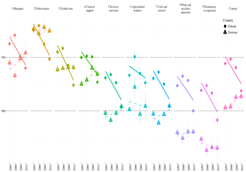
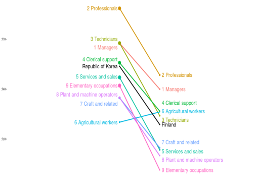

**Trends in Occupations** perspective displays students' mean performance on vertical axis and year of study on horizontal axis. This plot helps you answer questions like: 

* In which occupations the results are improving over years?  
* Are the trends in two countries similar or different?  
* In which categories difference between countries became smaller/bigger?

***

**Two countries** perspective displays students' mean performance on vertical axis and two countries on left and right sides of the plot. Some of questions it may answer are: 

* Do the countries have similar results for all occupations?   
* In which country the difference between best- and worst-performing occupation is bigger?
* Which occupations have mean results better than their country's mean?

