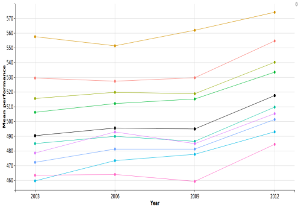
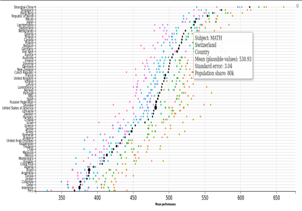

**Trends in two countries** perspective displays students' mean performance on vertical axis and year on horizontal axis. Plots showing two countries are displayed side-by-side for comparison. This plot helps answer questions like:  

* Did the structure of results change over years?   
* Did the spread in results got bigger or smaller?  
* Did the spread change because of one or more categories?  

***

**All countries** perspective displays students' mean performance on horizontal axis and names of the countries on vertical axis. It helps find out for example:  

* Which countries achieve the best mean results?  
* How are top countries different between subjects?  
* How big is the difference between best- and worst-performing countries?  

